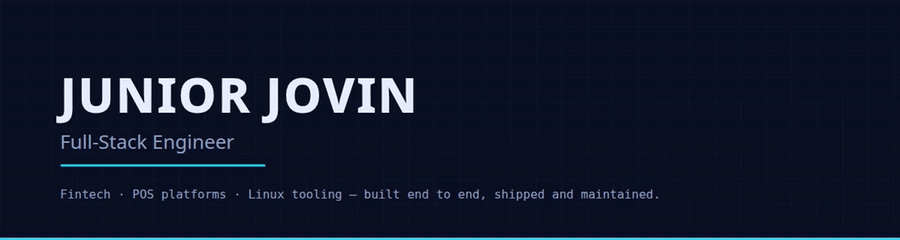
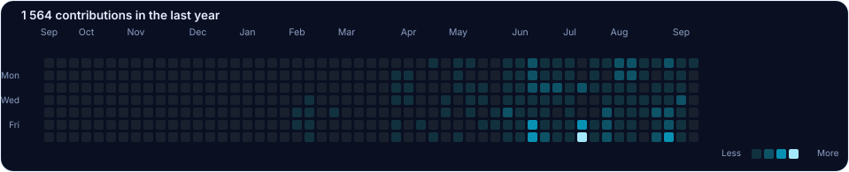

<!-- ══════════════════════════ HERO ══════════════════════════ -->
<p align="center">
  <picture>
    <source media="(prefers-color-scheme: dark)"  srcset="assets/hero-dark.svg">
    <source media="(prefers-color-scheme: light)" srcset="assets/hero-light.svg">
    
  </picture>
</p>

<!-- ══════════════════════════ REEL ══════════════════════════ -->

## Showreel

<a href="assets/showreel.mp4">
  
</a>

<p align="center">
  <a href="https://github.com/jsticks779?tab=repositories"></a>
  <a href="https://github.com/jsticks779?tab=followers"></a>
  
</p>

<p align="center">
  <a href="mailto:juniorjovin208@gmail.com"></a>
  <a href="https://github.com/jsticks779"></a>
  
</p>


<!-- ══════════════════════════ ABOUT ══════════════════════════ -->

## About

I'm **Junior Jovin** — a full-stack engineer, building software for the problems I can
actually see around me: shops that still track stock on paper, workers with no credit
history, laptops that can't share the Wi-Fi they're already on.

I work end to end — schema, API, UI, deploy — and I like the unglamorous parts: permission
systems, migrations, webhook signatures, and drivers that lie to you.

```ts
const junior = {
  role:      "Full-Stack Engineer",
  company:   "JOVINX TECH",
  building:  ["POS & fintech platforms", "Linux desktop tools", "AI-assisted products"],
  daily:     ["TypeScript", "React", "Node + Express", "Prisma", "PostgreSQL"],
  also:      ["Python", "React Native", "PHP", "Bash", "Docker"],
  languages: ["English", "Kiswahili"],
  philosophy: "ship it, then make it fast",
};
```

|  |  |
|---|---|
| 🔭 **Working on** | Sellin — a multi-shop POS & business platform for retail businesses |
| 🌱 **Learning** | distributed systems, LLM tooling, and Solidity |
| ⚡ **Fun fact** | most guides say one Wi-Fi card can't be a client *and* an access point. [Mine can.](https://github.com/jsticks779/Hotspot-on-linux) |
| 💬 **Ask me about** | React · Node · Prisma · Postgres · mobile money integrations · Linux |
| 📫 **Reach me** | [juniorjovin208@gmail.com](mailto:juniorjovin208@gmail.com) |


<!-- ══════════════════════════ STACK ══════════════════════════ -->

## Stack

<p align="center">
  <picture>
    <source media="(prefers-color-scheme: dark)"  srcset="assets/stack-dark.svg">
    <source media="(prefers-color-scheme: light)" srcset="assets/stack-light.svg">
    
  </picture>
</p>


<!-- ══════════════════════════ PROJECTS ══════════════════════════ -->

## Featured projects

<table>
  <tr>
    <td width="50%">
      <a href="https://github.com/jsticks779/Hotspot-on-linux">
        <picture>
          <source media="(prefers-color-scheme: dark)"  srcset="assets/cards/hotspot-dark.svg">
          <source media="(prefers-color-scheme: light)" srcset="assets/cards/hotspot-light.svg">
          
        </picture>
      </a>
    </td>
    <td width="50%">
      <a href="https://github.com/jsticks779/jUNIODEV-UI">
        <picture>
          <source media="(prefers-color-scheme: dark)"  srcset="assets/cards/juniodev-ui-dark.svg">
          <source media="(prefers-color-scheme: light)" srcset="assets/cards/juniodev-ui-light.svg">
          
        </picture>
      </a>
    </td>
  </tr>
  <tr>
    <td width="50%">
      <a href="https://github.com/jsticks779/MyPManager">
        <picture>
          <source media="(prefers-color-scheme: dark)"  srcset="assets/cards/mypmanager-dark.svg">
          <source media="(prefers-color-scheme: light)" srcset="assets/cards/mypmanager-light.svg">
          
        </picture>
      </a>
    </td>
    <td width="50%">
      <a href="https://github.com/jsticks779/jcamera-for-linux">
        <picture>
          <source media="(prefers-color-scheme: dark)"  srcset="assets/cards/jcamera-dark.svg">
          <source media="(prefers-color-scheme: light)" srcset="assets/cards/jcamera-light.svg">
          
        </picture>
      </a>
    </td>
  </tr>
  <tr>
    <td width="50%">
      <a href="https://github.com/jsticks779/Ghost-Screen">
        <picture>
          <source media="(prefers-color-scheme: dark)"  srcset="assets/cards/ghost-screen-dark.svg">
          <source media="(prefers-color-scheme: light)" srcset="assets/cards/ghost-screen-light.svg">
          
        </picture>
      </a>
    </td>
    <td width="50%">
      <a href="https://github.com/jsticks779/Efootball-league-manager">
        <picture>
          <source media="(prefers-color-scheme: dark)"  srcset="assets/cards/efootball-dark.svg">
          <source media="(prefers-color-scheme: light)" srcset="assets/cards/efootball-light.svg">
          
        </picture>
      </a>
    </td>
  </tr>
</table>

### Also in the workshop

| Project | What it is | Stack |
|---|---|---|
| **Sellin** | Multi-shop POS & business platform — inventory, credit sales, mobile-money billing, AI report scanning, online store builder | React · Express 5 · Prisma · PostgreSQL · Redis · Socket.IO |
| **TrustMkononi** | Digital trust score for the informal economy — verified work history unlocking micro-credit, reachable over USSD | React · Node · PostgreSQL · Africa's Talking |
| **SafariPay** | Instant P2P payments and on-chain micro-credit with mobile-money on/off ramps | Polygon · Solidity · React |
| **SaveFlow** | Offline-first social link organiser for iOS & Android | React Native · Expo · Express · PostgreSQL |
| **HealthLink** | Appointment booking, consultations and emergency alerts for clinics | React · Express · Prisma |
| **KodiRada Hub** | Tax-compliance radar concept submitted to the TRA Wazo Bunifu competition | Product / systems design |


<!-- ══════════════════════════ STATS ══════════════════════════ -->

## Stats

<p align="center">
  <picture>
    <source media="(prefers-color-scheme: dark)"  srcset="assets/stats-dark.svg">
    <source media="(prefers-color-scheme: light)" srcset="assets/stats-light.svg">
    
  </picture>
  <picture>
    <source media="(prefers-color-scheme: dark)"  srcset="assets/streak-dark.svg">
    <source media="(prefers-color-scheme: light)" srcset="assets/streak-light.svg">
    
  </picture>
</p>

<p align="center">
  <picture>
    <source media="(prefers-color-scheme: dark)"  srcset="assets/top-langs-dark.svg">
    <source media="(prefers-color-scheme: light)" srcset="assets/top-langs-light.svg">
    
  </picture>
</p>

<p align="center">
  <picture>
    <source media="(prefers-color-scheme: dark)"  srcset="assets/trophy-dark.svg">
    <source media="(prefers-color-scheme: light)" srcset="assets/trophy-light.svg">
    
  </picture>
</p>

<p align="center">
  <picture>
    <source media="(prefers-color-scheme: dark)"  srcset="assets/graph-dark.svg">
    <source media="(prefers-color-scheme: light)" srcset="assets/graph-light.svg">
    
  </picture>
</p>

<!-- The snake is generated by .github/workflows/snake.yml and pushed to the `output` branch -->
<p align="center">
  <picture>
    <source media="(prefers-color-scheme: dark)"  srcset="https://raw.githubusercontent.com/jsticks779/jsticks779/output/github-snake-dark.svg">
    <source media="(prefers-color-scheme: light)" srcset="https://raw.githubusercontent.com/jsticks779/jsticks779/output/github-snake.svg">
    
  </picture>
</p>


<!-- ══════════════════════════ NOW ══════════════════════════ -->

## Currently

- 🚧 Shipping **Sellin** to more shops — and keeping the AI features cheap to run
- 🐧 Maintaining my Linux desktop tools: **Hotspot on Linux**, **jUNIODEV-UI**, **JCamera**, **Ghost Screen**
- 🧪 Digging into distributed systems, queues, and LLM agent tooling
- 🤝 Open to **collaboration**, **freelance work**, and **open-source contributions**
- ✍️ Writing up the driver-level Wi-Fi lessons I learned the hard way

<p align="center">
  
</p>

<!-- ══════════════════════════ FOOTER ══════════════════════════ -->

<p align="center">
  <picture>
    <source media="(prefers-color-scheme: dark)"  srcset="assets/footer-dark.svg">
    <source media="(prefers-color-scheme: light)" srcset="assets/footer-light.svg">
    
  </picture>
</p>

<p align="center">
  <a href="mailto:juniorjovin208@gmail.com"></a>
</p>

<p align="center"><sub>⭐ If any of my work saved you time, a star means a lot.</sub></p>